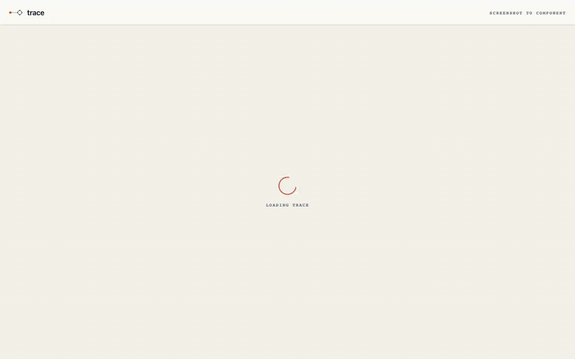

# Trace

**Paste a screenshot. Get a real, runnable React component.**

 <!-- TODO add gif -->

Live demo: <!-- TODO -->

## What it does

Trace turns a UI screenshot into a self-contained React + TypeScript component you can run, edit, and ship. Paste from your clipboard, drop a PNG, or upload a file. Google Gemini recreates the layout as a real component, grounded in a shadcn-style component catalog, and renders it live in an editable sandbox so you can see the result and tweak it on the spot.

## Why it's different

1. **Design-system grounding.** Generation is constrained to a real component catalog (an in-prompt whitelist), so Trace reuses actual components and variants instead of inventing generic markup.
2. **"What the AI sees" detection panel.** Every detected UI element is mapped to a component, a variant, and a confidence score, so the output is inspectable rather than a black box.
3. **Live, editable preview.** The component renders in a Sandpack sandbox you can edit in place, not a static screenshot of code.
4. **Self-repair loop.** Generated code is compile-checked with esbuild and auto-fixed by re-prompting on failure (up to 2 passes). Runtime errors in the preview get a one-click "Ask Trace to fix it" that re-prompts with the error.
5. **Accessibility score.** axe-core runs against the rendered component for a 0-100 score plus a violations list, with a one-click "Fix accessibility" that re-prompts Gemini to resolve them.

## How it works

```
Screenshot (paste / drop / upload)
        |
        v
Gemini grounded generation  (catalog whitelist in prompt)
        |
        v
Sandpack live render  (editable React + TS)
        |
        +--> axe-core accessibility score
        |
        +--> esbuild compile check -> self-repair (re-prompt, max 2 passes)
```

## Tech stack

| Layer | Technology |
|-------|------------|
| Framework | Vite 7, React 19, TypeScript (strict) |
| Styling | Tailwind CSS (cartographic theme) |
| AI | `@ai-sdk/google` + `ai` v6, model `gemini-2.5-flash` |
| Sandbox | `@codesandbox/sandpack-react` |
| Accessibility | `axe-core` |
| Validation | `zod` |
| API | Serverless `api/generate.ts` (Vercel function) + a Vite dev middleware so `/api/generate` works under `pnpm dev` |
| Search (optional) | Algolia, powering the secondary Chat tab only |

## Getting started

```bash
git clone https://github.com/forbiddenlink/trace.git
cd trace
pnpm install
```

Set your Gemini key in `.env`:

```bash
GOOGLE_GENERATIVE_AI_API_KEY=your-key-here
```

This is the **only** required key. The Algolia `VITE_ALGOLIA_*` variables are optional and only enable the secondary Chat tab; the app boots and the Studio and Explore tabs work without them.

```bash
pnpm dev
```

Open http://localhost:5173.

## Try it with no key

Trace ships with an example gallery: four preloaded UIs (pricing card, login form, dashboard stat cards, navigation sidebar) with cached generation results. Click any thumbnail on the Studio empty state to load a full result (detection panel, live preview, accessibility score) with **no API key and no network call**. It is the fastest way to see what Trace does.

## Accessibility

Every rendered component is scored with axe-core (0-100) and its violations are listed inline. "Fix accessibility" re-prompts Gemini to resolve the reported issues. The automated check catches roughly half of WCAG issues, so treat the score as a directional signal rather than a certification. The app's own UI uses semantic landmarks, ARIA tabs, keyboard navigation, and visible focus styles.

## Background

Trace began as a component-search chatbot (ComponentCompass) for the Algolia Agent Studio Challenge in February 2026, was shelved, then revived and reframed for the DEV.to GitHub Finish-Up-A-Thon and renamed to Trace. The Algolia chatbot survives as the optional Chat tab. Read the story: <!-- TODO post URL -->

## License

MIT - Liz Stein, 2026. See [LICENSE](LICENSE).
